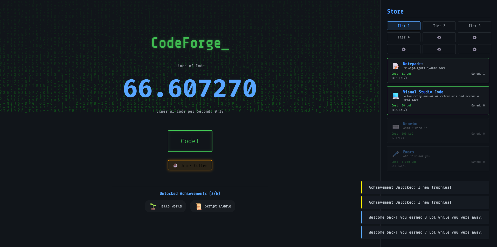

# CodeForge

i wanted to make a hacker game so i built this idle clicker. you start by typing your first line of code and end up crashing a virtual tech stock market. everything saves to your browser automatically.

built for **#horizons**

**play it here:** https://code-forge-swart.vercel.app/

## screenshots

## how to play

- **CLICK** the big code button to generate Lines of Code (LoC)
- buy **UPGRADES** from the right sidebar to automate your production
- click **DRINK COFFEE** for a massive 30-second overclock multiplier
- unlock the **TECH TREE** using Refactor Tokens for permanent buffs
- play the **TECH EXCHANGE** tab to day-trade fake stocks and gamble your LoC
- everything runs in real-time, even if you close the tab!

## features

| feature | what it does |
|---------|-------------|
| tech exchange | a fully functional stock market where prices jump every 3 seconds based on a volatility algorithm. buy low, sell high to get rich. |
| visual progression | the more loc per second you produce, the more animated servers visually boot up in your server rack on the left side of the screen. |
| dynamic audio | retro mechanical keyboard sounds and upgrade chimes are generated entirely by code using the browser's audio engine. |
| offline progress | the game calculates exactly how long you were gone and awards you your automated code production when you return. |

## built with

- **react:** for the interface
- **zustand:** for saving and managing the game state

## how it works

the game basically runs on an infinite loop. every frame, it checks how much automated code you should be generating and adds it to your wallet. the stock market runs on its own separate timer to randomly swing prices up and down.

## ai usage

i used ai as a pair-programmer to debug react errors and fix styling.